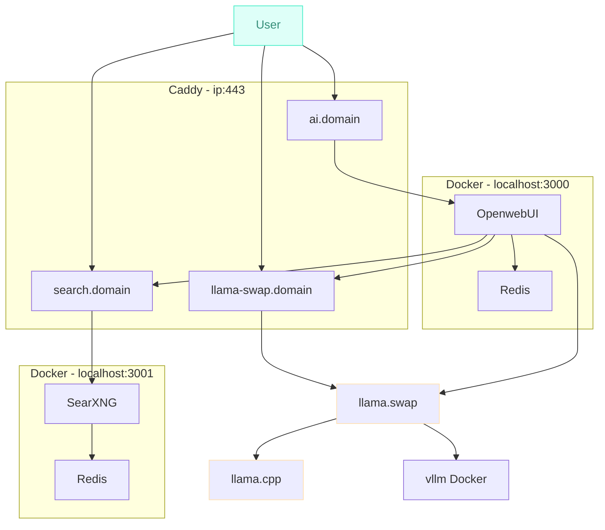

# Text Model Lab

High level diagram and descriptions below. Config files for ewach component in their respective folders.

## Purpose
* Demonstrate quick deployment of AI/LLM frontends and supporting components, allowing you to concentrate on actually using models.
* Ensure everything can run on-prem with NO external dependancies when using models.
* Reproducable structure for larger scale deployments.

## High Level Component Diagram

## External Projects and Components

* https://github.com/ggerganov/llama.cpp/
* https://github.com/mostlygeek/llama-swap

## Hardware
Current lab hardware. 
Note the GPU is adding a difficultly level if I did it again I'd use something better supported (NVIDIA or Apple M-Series), however the cost/RAM/tokens/sec ratio is pretty good.

* Intel(R) Xeon(R) W-1290 CPU @ 3.20GHz
* 128GB RAM
* Intel A770 16GB GPU
