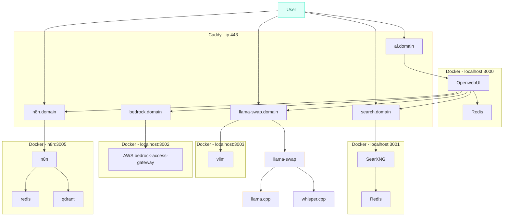

# AI Model Lab

High level diagram and descriptions below. Config files for each component in their respective folders.

## Purpose
* Demonstrate quick deployment of AI/LLM frontends and supporting components, allowing you to concentrate on actually using models and workflow tools.
* Ensure everything can run on-prem with no external dependancies if required (retaining OpenAI API compatibility).
* Allow for "boost" capacity in the cloud allowing interaction with larger models.
* Reproducable structure for larger scale deployments.

## High Level Component Diagram

## External Projects and Components

### On-Prem model servers and management
* https://github.com/mostlygeek/llama-swap
* https://github.com/ggerganov/llama.cpp/
* https://github.com/ggml-org/whisper.cpp
* https://github.com/vllm-project/vllm

### Off-Prem model access
* https://github.com/aws-samples/bedrock-access-gateway

### AI Workflow Tools
* https://n8n.io/

### Intel GPU Related Links
* https://testbigdldocshane.readthedocs.io/en/perf-docs/index.html

## Hardware
Current lab hardware is listed below. 
Note original lab used a Intel A770 16GB GPU,  this added a difficultly level that was not worth the time invested in getting required software working (though it did work text based tasks), hence the move to Nvidia 3090s.

* Intel(R) Xeon(R) W-1290 CPU @ 3.20GHz
* 128GB RAM
* ~~Intel A770 16GB GPU~~
* 2 x Nvidia 3090 24GB GPU (NVLINK)
* 1 x 500GB SATA SSD (Boot)
* 3 x 1TB M.2 SSD (models used by llama-swap maanged services, docker storage, working files, etc)
* 2 x 10TB HDD (ZFS MIRROR for unmodified models)
