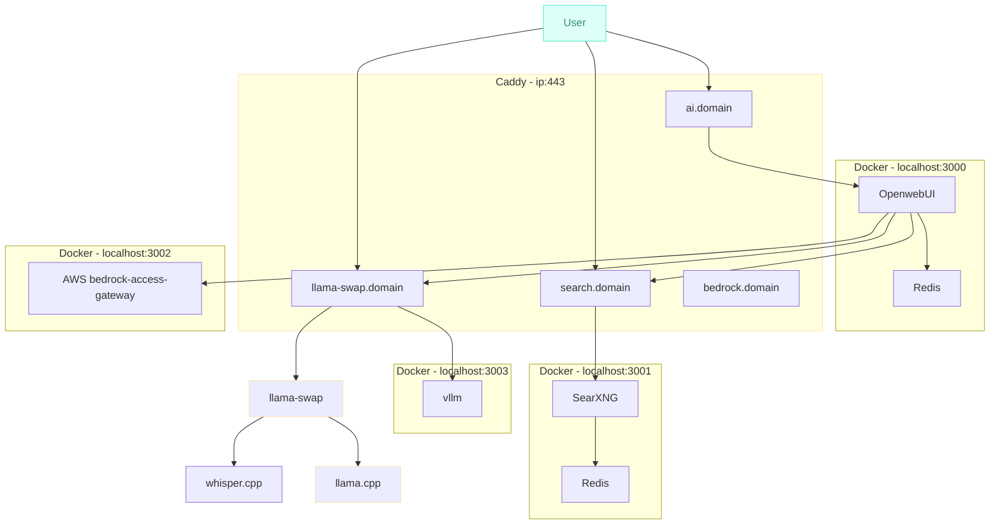

# AI Model Lab

High level diagram and descriptions below. Config files for ewach component in their respective folders.

## Purpose
* Demonstrate quick deployment of AI/LLM frontends and supporting components, allowing you to concentrate on actually using models.
* Ensure everything can run on-prem with NO external dependancies when using models.
* Allow for "boost" capacity in the cloud allowing interaction with larger models.
* Reproducable structure for larger scale deployments.

## High Level Component Diagram

## External Projects and Components

* https://github.com/ggerganov/llama.cpp/
* https://github.com/mostlygeek/llama-swap
* https://github.com/aws-samples/bedrock-access-gateway
* https://testbigdldocshane.readthedocs.io/en/perf-docs/index.html

## Hardware
Current lab hardware. 
The original lab ujsed a Intel A770 16GB GPU,  this added a difficultly level that was not wroth the time invested in getting thing working (thought it did work for basic tasts). Hence the move to Nvidia 3090s.

* Intel(R) Xeon(R) W-1290 CPU @ 3.20GHz
* 128GB RAM
* ~~Intel A770 16GB GPU~~
* 2 x Nvidia 3090 24GB GPU
